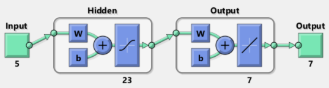
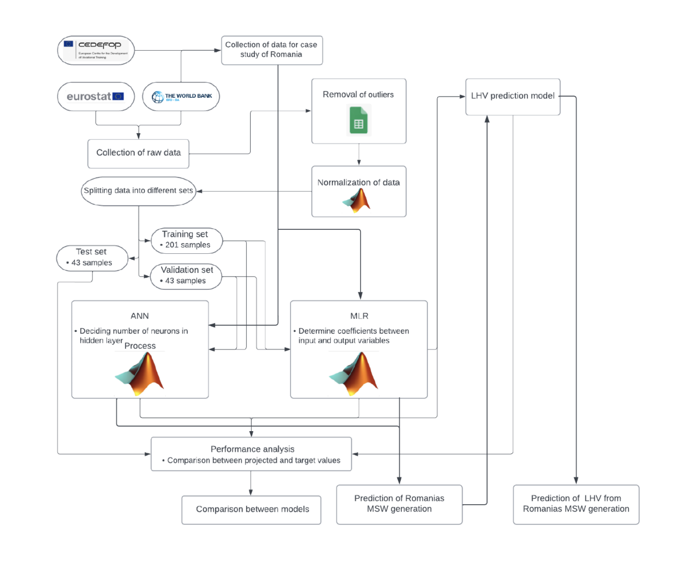
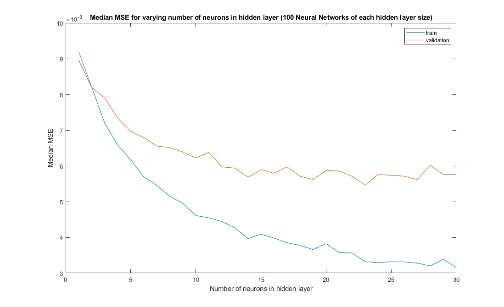

# Prediction of Municipal Solid Waste Generation and its corresponding Lower Heating Value in the EU

**Typ:** Kandidatexamensarbete (KTH, 2024)  
**Roll:** Självständigt arbete – ansvarade för hela projektet med projektpartner (datainsamling, modellering, analys och rapport).  
**Språk:** MATLAB  

---

## Syfte
Huvudsyftet av projektet var att undersöka hur maskininlärning kan användas för att stödja **långsiktig hållbar energi- och resursplanering** genom dataanalys. Således utvecklades två prediktiva modeller för att uppskatta mängden **energi som kan återvinnas från avfall i EU-länder**, baserat på data om avfallsflöden, materialkomposition och socio-ekonomiska riktmärken. 

Projektet jämförde en **Artificial Neural Network (ANN)** med en klassisk **Multiple Linear Regression (MLR)**-modell för att bedöma skillnader i noggrannhet och generaliseringsförmåga. Efter den slutgiltiga modelen blivit vald tillämpades den på en fallstudie för Rumänien. 

---

### Metod och implementation
- **Datakällor:** Insamling av avfalls- och energidata samt mått på socio-ekonomisk förhållanden för EU-länder utfördes m.h.a.Eurostat och The World Bank Group.
- **Datahantering:** Preprocessing, borttaggning av datapunkter och urval av prediktorer. 
- **ANN-arkitektur:**
ANN modelen utvecklades med en 70%/15%/15% training/validation/test split där antalet gömda neuroner baserades på vad som gav lägsta mediana validation error baserat på 100 individuella nätverk utvecklade på tränings datan (se längre ned).

  - 5 inputs som representerar socio-ekonomiska metriker
  - Ett dolt lager med 23 gömda noder, sigmoidaktivering
  - 7 outputs som representerade mängd av respektive avfallstyp
  - Tränad med backpropagation (Levenberg–Marquardt-algoritmen)
- **Baslinje:** MLR tränad på samma dataset  
- **Utvärderingsmått:** R, R², RMSE, MAPE, MdAPE, APE

**Flowchart som illustrerar av alla steg som utfördes under projektets**

**Training och validation error i samband med ökande mängd gömda neuroner**

---

## Resultat
- **Modellprestanda** baserat på test
| **Prestandamått** | **ANN** | **MLR** |
|--------------------|:-------:|:-------:|
| MSE | 0.0076* | 0.0104* |
| R (test)* | **0.9133** | **0.8661** |
| R² | 0.6332 | 0.5375 |
| RMSE [Mt] | 1.7223 | 1.9340 |
| MAPE [%] | 60.33 | 97.98 |
| MdAPE [%] | 38.24 | 51.44 |

Det neurala nätverket gav cirka **15 % bättre noggrannhet** jämfört med den linjära modellen.  
Känslighetsanalys visade att **avfallssammansättning och lägre värmevärde (LHV)** var de mest betydelsefulla faktorerna.
 
- **ANN-modellen** uppnådde högre förklaringsgrad och lägre fel än MLR.  
- Modellerna användes för att förutsäga framtida energiåtervinning (Rumänien 2025 och 2035).  
- Känslighetsanalysen visade att ökade andelar plast och papper höjde det beräknade LHV-värdet.

---

## Lärdomar
- Skillnader mellan linjära och icke-linjära modeller i praktiska energisystem.  
- Hur feature-val och dataskalning påverkar ANN-prestanda.  
- Förmågan att kombinera teknisk modellering med hållbarhetsanalys.

---
Full rapport: [`report/KEX_Slutinläming_2024-05-23.pdf`](./report/KEX_Slutinläming_2024-05-23.pdf)
