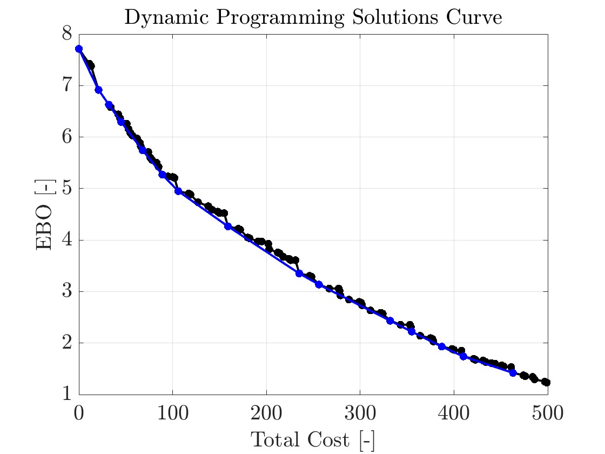

# Optimization of Spare Parts Allocation using Marginal Allocation and Dynamic Programming

**Typ:** Projekt inom kursen *Systems Engineering, KTH 2024*  
**Roll:** Implementation av optimeringsalgoritmer, simulering och rapportskrivning i sammarbete med projektpartner

**Språk:** MATLAB  

---

## Syfte
Projektet syftade till att tillämpa teorin bakom **spare-parts-optimering** på ett flygunderhållsscenario och jämföra två metoder:
- **Marginal Allocation (MA)** för att identifiera effektiva lösningar under en budgetbegränsning.  
- **Dynamic Programming (DP)** för att finna den globala optimala lösningen.

Uppgiften modellerade hur ett flygbaslager bör dimensioneras för att minimera antalet markbundna flygplan (**Expected Backorders, EBO**) givet en fast budget för reservdelar.

---

## Metod och implementation

### Problemformulering
- Nio olika **Line Replaceable Units (LRU)**, **s**=[s1,...,s9], representerar komponenter som hjul, motorer och radar.  
- Varje komponenttyp har:
  - **λ**: felhastighet  
  - **T**: genomsnittlig reparationstid  
  - **c**: inköpskostnad  
- Målet: minimera \(EBO(**s**)\) under budgetbegränsningen \(C(**s**) ≤ Cbudget\).  

### Marginal Allocation (MA)
- Utvärderade **hur EBO minskar** när nya reservdelar läggs till.  
- Effektiva punkter beräknades upp till \(C_budget = 500 kr\).  
- Varje iteration valde den LRU med **högst marginalnytta per kostnad**.  

### Dynamic Programming (DP)
- Problemets rekursiva struktur utnyttjades för att hitta **globala optima** vid olika budgetnivåer.  
- Definierade:
  - *Stages:* komponenttyper (LRU1–LRU9)  
  - *States:* kvarvarande budget  
  - *Decision variable:* antal reservdelar per LRU  
- Beräknade optimala lösningar för budgetnivåer {0, 100, 150, 350, 500} [kr].  

---

## Resultat

### Effektiva punkter vid tillämpning av Marginal Allocation  
Cbudget = 500 kr  

| **Eff. Point** | **s₁** | **s₂** | **s₃** | **s₄** | **s₅** | **s₆** | **s₇** | **s₈** | **s₉** | **EBO(s)** | **C(s)** |
|:--------------:|:------:|:------:|:------:|:------:|:------:|:------:|:------:|:------:|:------:|:----------:|:--------:|
| 1 | 0 | 0 | 0 | 0 | 0 | 0 | 0 | 0 | 0 | 7.71 | 0 |
| 2 | 0 | 0 | 0 | 1 | 0 | 0 | 0 | 0 | 0 | 6.91 | 21 |
| 3 | 0 | 0 | 0 | 1 | 1 | 0 | 0 | 0 | 0 | 6.63 | 32 |
| 4 | 1 | 0 | 0 | 1 | 1 | 0 | 0 | 0 | 0 | 6.29 | 45 |
| 5 | 1 | 0 | 1 | 1 | 1 | 0 | 0 | 0 | 0 | 5.74 | 68 |
| 6 | 1 | 0 | 1 | 2 | 1 | 0 | 0 | 0 | 0 | 5.27 | 89 |
| 7 | 1 | 1 | 1 | 2 | 1 | 0 | 0 | 0 | 0 | 4.95 | 106 |
| 8 | 1 | 1 | 1 | 2 | 1 | 1 | 0 | 0 | 0 | 4.27 | 159 |
| 9 | 1 | 1 | 1 | 2 | 1 | 1 | 1 | 0 | 0 | 3.35 | 235 |
| 10 | 1 | 1 | 1 | 3 | 1 | 1 | 1 | 0 | 0 | 3.14 | 256 |
| 11 | 1 | 1 | 1 | 3 | 1 | 1 | 2 | 0 | 0 | 2.43 | 332 |
| 12 | 1 | 1 | 1 | 3 | 1 | 1 | 2 | 0 | 1 | 2.22 | 355 |
| 13 | 1 | 1 | 1 | 3 | 1 | 1 | 2 | 1 | 1 | 1.93 | 387 |
| 14 | 1 | 1 | 2 | 3 | 1 | 1 | 2 | 1 | 1 | 1.74 | 410 |
| 15 | 1 | 1 | 2 | 3 | 1 | 2 | 2 | 1 | 1 | **1.42** | **463** |

### Optimala Lösningar vid implentering av Dynamic Programming  
Budget begräninsgar: Cbudget ∈ {0, 100, 150, 350, 500} [kr].

| **Cbudget** | **s₁** | **s₂** | **s₃** | **s₄** | **s₅** | **s₆** | **s₇** | **s₈** | **s₉** | **EBO(s)** | **C(s)** |
|:----------------------:|:------:|:------:|:------:|:------:|:------:|:------:|:------:|:------:|:------:|:----------:|:--------:|
| 0   | 0 | 0 | 0 | 0 | 0 | 0 | 0 | 0 | 0 | 7.71 | 0 |
| 100 | 1 | 0 | 1 | 2 | 2 | 0 | 0 | 0 | 0 | 5.22 | 100 |
| 150 | 1 | 1 | 1 | 3 | 1 | 0 | 0 | 0 | 1 | 4.52 | 150 |
| 350 | 1 | 1 | 1 | 2 | 1 | 1 | 2 | 1 | 0 | 2.36 | 343 |
| 500 | 2 | 1 | 2 | 3 | 1 | 1 | 3 | 1 | 1 | **1.23** | **499** |

**Visualisering av effektiva lösningar (MA) och globala optimum (DP):** blåa punkter representerar effektiva punkter från MA medans the svarta visar optimala lösningar från DP.

---

## Lärdomar
- Marginal Allocation ger en snabb överblick över effektiva kompromiser mellan kostnad och prestanda.  
- Dynamic Programming ger den exakta globala lösningen men är beräkningsmässigt mer krävande.  
- Projektet illustrerade praktisk tillämpning av **optimering, rekursiva metoder och resursplanering** inom systems engineering.  

---

## Rapport
📄 [Optimization of Spare Parts Allocation (KTH, 2024)](./Allocation_Report.pdf)
